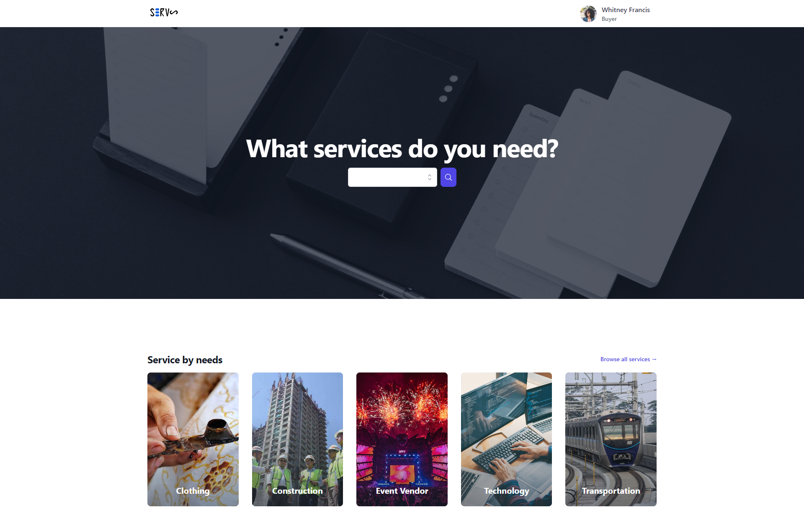
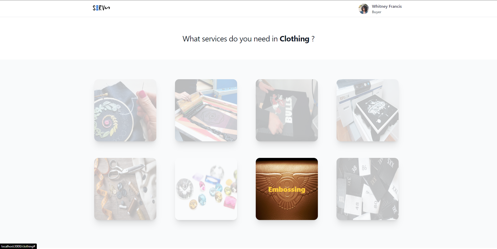
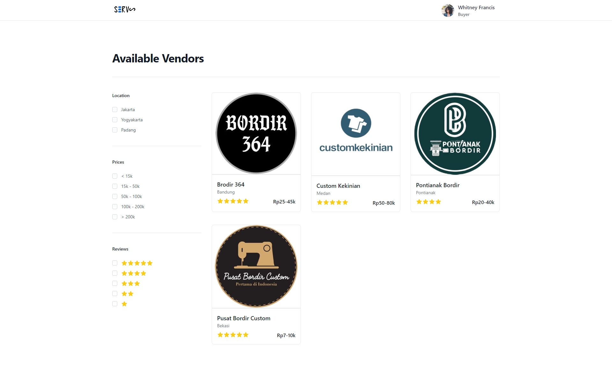
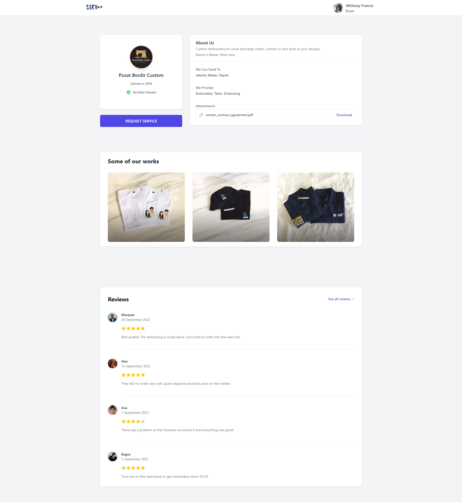
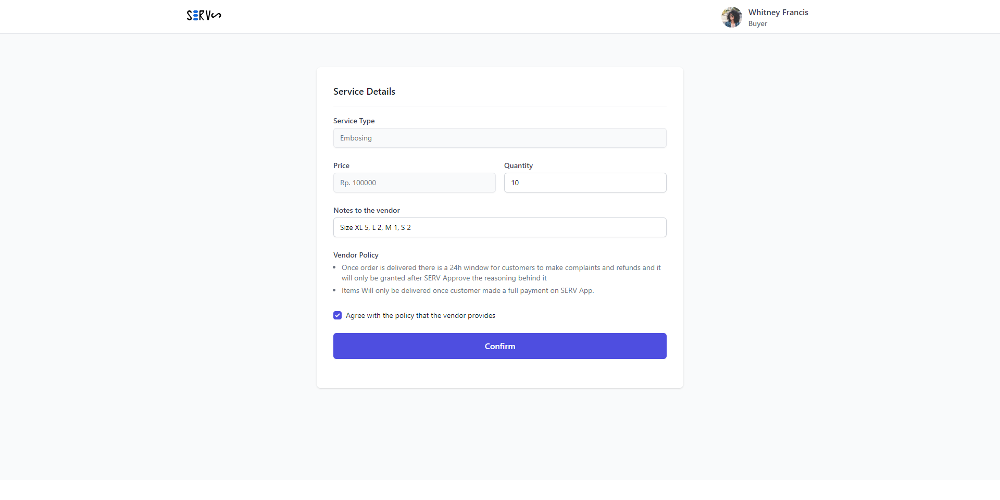
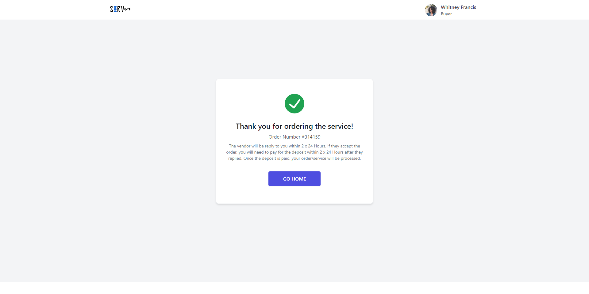
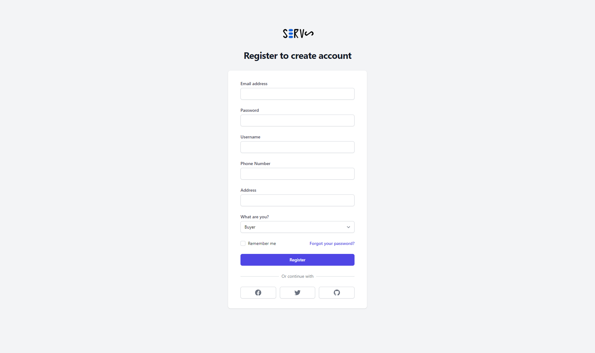

# Description

Serv is a platform for MSMEs to be able to easily find good vendors or services that are fits their needs. For example, if someone wants to produce graphic t-shirts, they will be able to find vendors who are excellent in their quality, production time and prices. Vendors, on the other hand, are pushed to have healthy competition.

## Showcase

## Getting Started

1. Install npm packages
   `npm i`
2. Run npm
   `npm run dev`
3. Open 'http://localhost:3000' in browser
